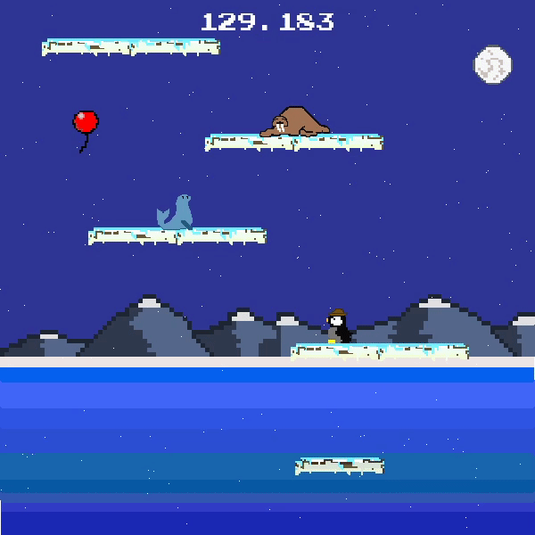

# Flightless

## Download

The game can be downloaded [here](https://drive.google.com/file/d/1LDzizuABTKBxqS-VQTg8leSHrN05Qb_l/view?usp=sharing)

## How to Play
  
  
### Goal
  The goal of the game is to get as high as you can. You can jump, bounce on other animals, and ride balloons that may randomly spawn.
  
### Controls

+ **ASDW** are the default controls. These can be changed to the **Arrow** keys in the options menu.
+ **Space** is the jump button. It can also be used to stutter your momentum (Flap) if the penguin is falling
+ **Esc** can be used to close the game
+ **F5** toggles between fullscreen/standard mode

