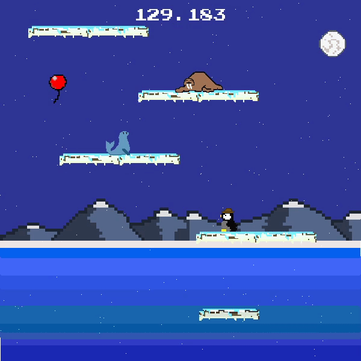
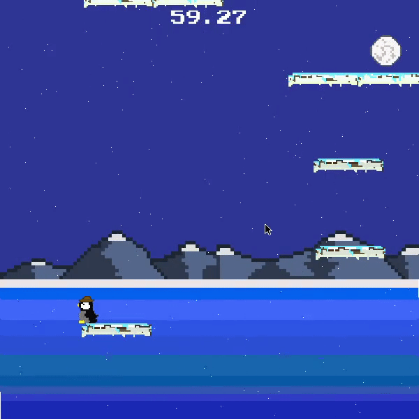
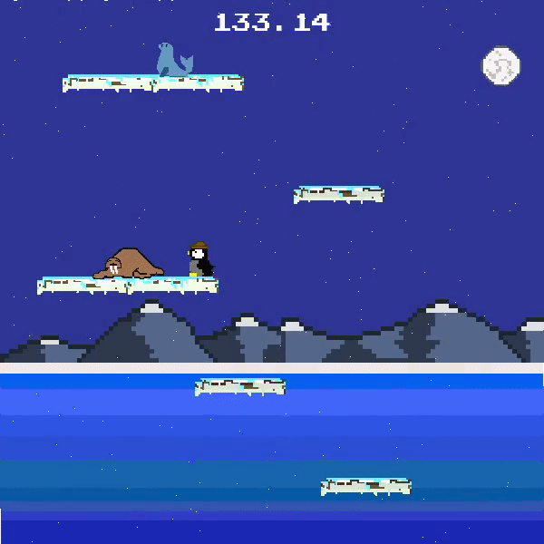

# Flightless

## Download

The game can be downloaded [here](https://drive.google.com/file/d/1LDzizuABTKBxqS-VQTg8leSHrN05Qb_l/view?usp=sharing)

## How to Play
  
  
### Goal
  The goal of the game is to get our flightless friend as high as you can. You can jump, bounce on other animals, and randomly spawning balloons to get the highest score possible.
  
### Controls

+ **ASDW** are the default controls. These can be changed to the **Arrow** keys in the options menu.
+ **Space** is the jump button. It can also be used to stutter your momentum (Flap) if the penguin is falling
+ **Esc** can be used to close the game
+ **F5** toggles between fullscreen/standard mode

### Tricks
  #### Screen Wrapping
  + **Jumping past the screen border will wrap you to the otherside**
  
  
  #### Bouncing
  + **Enemies can be bounced on for extra height if you jump on top of them**
  
  
  + **Careful not to miss, or you will get stunned and knocked away!**
